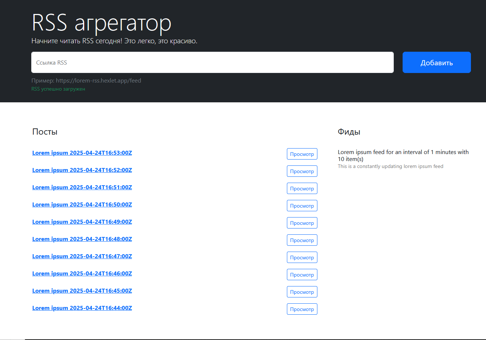

### Hexlet tests and linter status:
[](https://github.com/elvis178/frontend-project-11/actions)
[](https://github.com/elvis178/frontend-project-11/actions)
[](https://codeclimate.com/github/elvis178/frontend-project-11/maintainability)

# RSS Feed Aggregator
A lightweight web application that collects and monitors RSS feeds for new content updates.
## Demo version
(https://frontend-project-11-plum-eight.vercel.app/)

## Install
Clone this repository:
```
git clone https://github.com/elvis178/frontend-project-11.git
cd frontend-project-11
```
### Install dependencies
```
make install
```
### Build the webpack
```
make build
```
## Development
```
make develop
```
